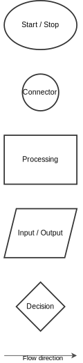

# Flowchart

Helps to map out logical sequences of potential solutions.

 

## Components

Oval: Start / Stop  
Small Circle: Connector  
Rectangle: Processing step  
Rhomboid: Input / Output  
Diamond: Decision (two branches)  
Arrows: Step by step (procedural) logic   flow direction      

 

;