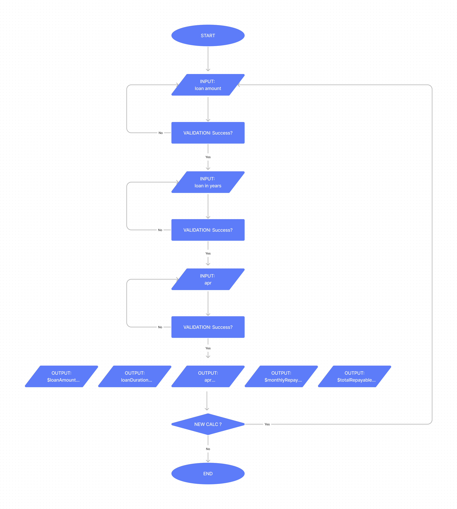

# Car Loan Calculator 

A program informing users how much monthly repayments will be on a loan for a car.

<br>

## Plan

<br>

### PEDAC
A system for solving problems:

<br>

#### P: Problem
The program should allow the user to enter an amount they wish to loan e.g. 10000 / $10,000  

The user should be able to enter an annual rate of percentage (APR) e.g. 5 / 5%  

The user should be able to select the amount of years they will take to repay the loan e.g. 4 years  

When this information has been obtained and validated

The program will calculate how many months the user will repay the loan over 

The program will calculate how much the user must pay back in interest each month 

The program will calculate the total amount repayable by the end of the loan including interest

<br>

#### E: Examples
Translated to JavaScript, the formula with example inputs for data looks like this: 
<br>

```JavaScript
let apr = 5.5; // INPUT
const APR_DECIMAL = apr / 100; // annual percentage rate of interest expressed as a decimal number to use for calculations on values

const MONTHS_IN_ONE_YEAR = 12;
const MONTHLY_INTEREST_RATE_DECIMAL = APR_DECIMAL / MONTHS_IN_ONE_YEAR;

let loanDurationInYears = 4; // INPUT
const LOAN_DURATION_IN_MONTHS = loanDurationInYears * MONTHS_IN_ONE_YEAR;

let loanAmount = 10000; // INPUT

const MONTHLY_REPAYMENT = loanAmount *(MONTHLY_INTEREST_RATE_DECIMAL / (1 - Math.pow((1 + MONTHLY_INTEREST_RATE_DECIMAL), (- LOAN_DURATION_IN_MONTHS)))); // OUTPUT

const TOTAL_AMOUNT_REPAYABLE = MONTHLY_REPAYMENT * LOAN_DURATION_IN_MONTHS;

console.log(TOTAL_AMOUNT_REPAYABLE.toFixed(2)); // OUTPUT: 11163.11

console.log(MONTHLY_REPAYMENT.toFixed(2)); // OUTPUT: 232.56
```

<br>

##### EDGE CASES  

OUTPUT: 
The outputs should be expressed as a $ amount with symbols e.g. 
`$(230.29293570646584).toFixed(2) // $230.29`

INPUT: apr 
The user should input a whole number
If the user enters a decimal by accident instead of a whole number should the program validate this? e.g.
`if (apr % 1 !== 0){ // then ask the user to enter a whole number}`
- Interest rates are not always whole numbers however so should the program account for decimal interest rates instead? e.g. 5.5% apr
- Perhaps it doesn't matter whether it is a whole number or decimal as calculations will be successful either way
- input should be validated for Number status: e.g. if (type of apr !== 'number`), make sure input is taken as a Number and not String or coerce because if validating for empty string also then variableName.trim() method only works on string values
- input should not be a negative number: e.g.  Math.abs(apr)
- What if 0% interested is chosen? Should 0% interest be allowed on loans equal to 1 year / 12 months or less? 
  - if this is the case and 1 year is chosen as an input then the program should not then ask for the interest rate input and should auto input 0% ?

INPUT: loanDuration
The user will be asked how many years they want to take to repay the loan: should this be open ended or a selection with min and max years shown? Should the input be in months instead? - this will alter the formula!
- if max then this will need to be validated to make sure it is not greater than the maximum value
- if min then this will need to be validated to make sure it is not less than the minimum value


<br>

#### D: Data Structure
Data from user inputs will be stored in variables. 
Modular / Functional programming principles will construct the flow of the program.

<br>

#### A: Algorithm
Pseudocode:
Informal:
- The program will print a welcome message welcoming the user to the Car Loan Calculator.
- The first question will prompt the user to ask how much they would like to loan?
  - this should be a positive number integer > 0
  - this should be below an upper limit? 
  - this should not be an empty entry
  - if entry is invalid then prompt for correct response again
- the second question will prompt the user to enter the duration in years to repay the loan
  - same validation as above but change parameters if required e.g. the max amount of years allowed
  - minimum loan duration = 1 year
- the third prompt will ask the user the annual rate of interest expressed as a whole number percentage e.g 5 for 5%
  - must be integer
  - must be whole number
  - must not be empty entry
  - must be greater than or equal to 0
- the monthly repayment amount will be calculated and displayed to the user
- the total loan amount can be displayed
- the total amount to be repaid can be displayed
- the user will be asked if they want to calculate a new repayment plan
- if yes reset the program and introduce the calculator again
  - validate response
- if no then end of program

<br>

Formal:

START
- SET and PRINT function welcome(){} to introduce user to the loan calculator
  - SET prompter function(message){} to print messages to the console prefixed with `=>` to greater distinguish questions / prompts from user responses
- SET a variable loanAmount
- PROMPT user for loanAmount and assign to variable
  - PERFORM validation function for each validation requirement
  
- SET a variable loanDurationInYears and assign to variable
- PROMPT user for loanDurationInYears and assign to variable
  - PERFORM validation functions for each validation requirement
  
- SET a variable annualRateOfInterest / apr
- PROMPT user for annualRateOfInterest and assign to variable
  - PERFORM validation functions for each validation requirement

- PRINT
  - loanAmount in dollars: $(10.000.00).toFixed(2)
  - loanDurationInYears: 4
  - apr: 5%
  - MONTHLY_REPAYMENT in dollars: $232.56
  - TOTAL_AMOUNT_REPAYABLE in $
- PROMPT user if they would like to perform a new calculation
- IF 
  - SET answer variable .toLowerCase() === "yes" or 'y' RUN program again
  - ELSE IF answer variable .toLowerCase() === "no" or'n' then end the program
END


Flowchart:



<br>

#### C: Convert to code with purpose
